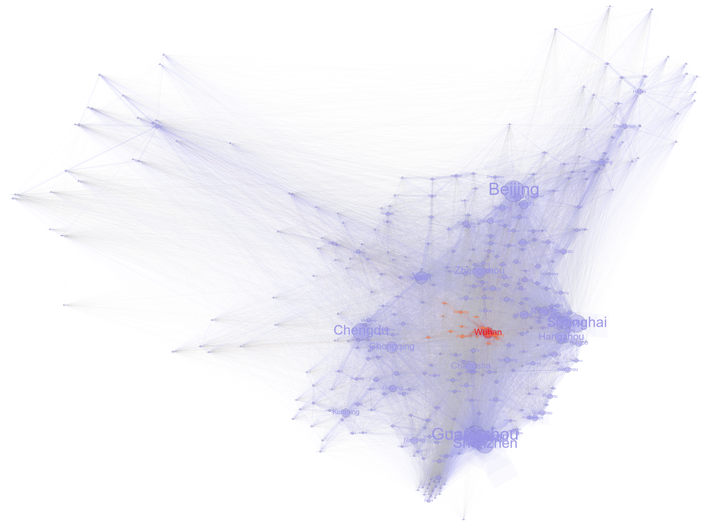

# Data and code release for the paper entitled: 
#### The spatial dissemination of COVID-19 and associated socio-economic consequences
<br/>





<br/>

`Figure1-Plot.ipynb`: plot Figure 1 in Python

`Figure2-Spatial analysis by R.ipynb`: spatial analysis of the spread of COVID-19 in R

`Figure2-Spatial analysis and plot.ipynb`: spatial analysis of the spread of COVID-19 in Python and plot Figure 2

`Figure3-Outbreak analysis by R.ipynb`: outbreak analysis of the spread of COVID-19 in R

`Figure3-Plot.ipynb`: plot Figure 3 in Python

`Figure4-Plot.ipynb`: plot Figure 4 in Python

`Table1-Economic analysis by R`: economic development analysis in R

<br/>

---
### Main dependencies:

#### Python
```
os
numpy
pandas
itertools
seaborn
matplotlib
statsmodels
collections
```

#### R
```
readr
MASS
dplyr
tidyr
texreg
```


---

Should you have any further quires about the code, please contact at: yflyzhang_at_gmail.com
